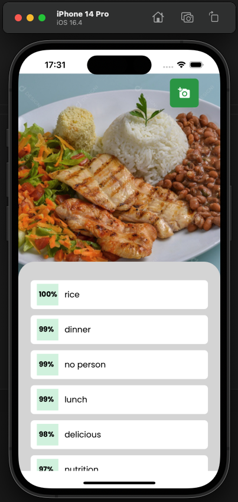

# `Index`

<a href="#About-the-APP">1. About the APP</a> <br />
<a href="#Technology-used">2. Technology used</a> <br />
<a href="#Library">3. Library</a> <br />
<a href="#How-to-download-the-project">4. How to download the project</a><br />
<a href="#Final-result">5. Final result</a>


## About the APP

Today I'm bringing here a small project that I did myself, just to put my knowledge into practice with artificial intelligence.

---

## Technology used

The project was developed using the technology:

- React-Native
- Axios
- TypeScript
- Clarifai (AI) https://www.clarifai.com/

## Library

- axios;
- expo-image-manipulator;
- expo-font;
- expo-image-picker;
- expo-status-bar;
- typescript.

---
## How to download the project


```bash

  # Clonar o repositório
  $ git clone https://github.com/DevTeles/goodplate-ia

  # Entrar no diretório
  $ cd goodplate-ia

  # Instalar as dependências
  $ yarn

  # Iniciar o projeto
  $ yarn start

  # De acordo com sistema operacional
  $ yarn android
  # ou
  $ yarn ios
```

## Final result

<h1 align="center">
  Goodplate-IA
  <br /> <br />
  
  <br />
</h1>


<br /><br />
Developed by **Rafael Teles Vital**
